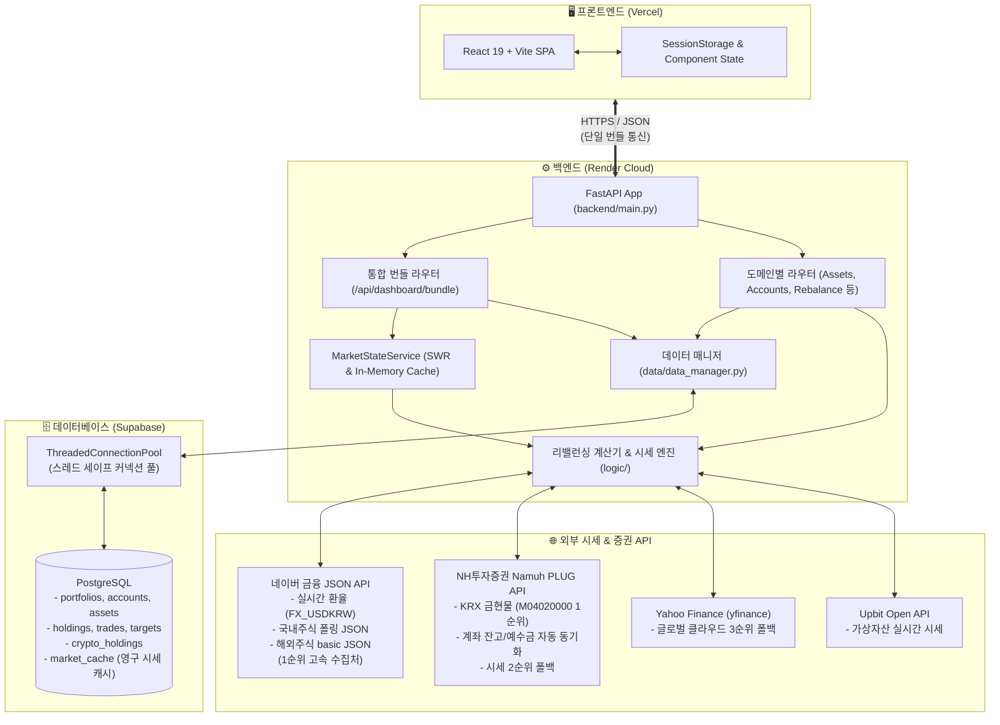

# 🏛️ 자산 배분 포트폴리오 리밸런서 (Portfolio Rebalancer)
## 시스템 구조 및 아키텍처 명세서 (System Architecture & Structure)

본 문서는 **다계좌·다중 포트폴리오 기반 자산 배분 및 리밸런싱 시스템**의 전체 소프트웨어 구조, 모듈별 역할, 데이터 흐름, 성능 최적화 아키텍처 및 데이터베이스 설계를 상세히 기술합니다.

---

## 1. 프로젝트 개요 (Overview)

- **목적**: 일반 주식, ISA, 연금저축, IRP, 정기예금 등 복수 계좌에 분산된 자산을 하나의 포트폴리오(또는 다중 포트폴리오)로 통합 관리하고, 목표 자산 배분 비중에 맞춰 최적의 매수/매도/이체 플랜을 자동으로 계산하여 실행하도록 돕는 자산 관리 플랫폼입니다.
- **주요 특징**:
  - **초고속 단일 번들 API**: 초기 로딩 시 단 1회의 HTTP 통신으로 대시보드/자산/계좌/환율 데이터를 일괄 수취 (Render 서버 기준 400~700ms, 세션 캐시 0ms)
  - **SWR (Stale-While-Revalidate) & 영구 DB 캐시**: PostgreSQL `market_cache` 테이블을 통한 Zero Cold-Start 및 백그라운드 무중단 시세 갱신
  - **네이버 금융 공식 JSON API 1순위 연동**: 실시간 환율, 국내주식, 미국주식 시세를 초고속(~500ms) 및 429 호출 제한 없이 안정적 수집 (NH API 및 yfinance 자동 폴백)
  - **특화 자산 완벽 지원**: KRX 금시장 현물(1g 단위 단가) 실시간 연동, 정기예금 일할 세후 누적이자 자동 가산
  - **탭 1 예금 포함/제외 토글**: 정기예금 포함 종합 현황과 순수 투자자산(주식/채권/대체투자) 전용 현황 간 원터치 실시간 전환
  - **스마트 리밸런싱 엔진**: IRP 위험자산 70% 규제 제한 자동 검증, 계좌별 우선순위 기반 자금 배분, 계좌 간 최소 이체 플랜 도출
  - **독립 가상자산 대시보드**: 업비트 API 연동 및 다인 소유자별 지분 관리

---

## 2. 전체 시스템 아키텍처



---

## 3. 디렉토리 및 파일 상세 구조

```
portfolio-rebalancer/
├── backend/                        # FastAPI 기반 고성능 RESTful 백엔드
│   ├── main.py                     # 애플리케이션 진입점, CORS, 라이프사이클 이벤트
│   ├── config.py                   # 중앙 설정 로더 (.env & secrets.toml 자동 감지)
│   ├── services.py                 # MarketStateService 싱글톤 (SWR 및 DB 캐시 연동)
│   └── routers/                    # 기능별 세부 API 라우터
│       ├── dashboard.py            # /api/dashboard/bundle (통합 번들), KPI, 자산 목록
│       ├── accounts.py             # 계좌 CRUD, 우선순위, 납입/세액공제 한도
│       ├── assets.py               # 자산 종목 CRUD, 목표비중, 정기예금 메타데이터
│       ├── trades.py               # 거래 기록 생성/조회/삭제 및 계좌 잔고 자동 연동
│       ├── rebalance.py            # 리밸런싱 실행, 이체 계획 도출, 시뮬레이션
│       ├── sync.py                 # NH투자증권 나무 계좌 잔고 원클릭 자동 동기화
│       ├── portfolios.py           # 다중 포트폴리오 관리 (생성, 전환, 복제)
│       ├── crypto.py               # 업비트 가상자산 시세, 소유자별 지분 관리
│       └── system.py               # 실시간 서버 및 외부 API 핑 지연시간 진단
│
├── data/                           # 데이터베이스 영속성 및 증권사 연동 계층
│   ├── data_manager.py             # PostgreSQL 연결 풀, DDL 마이그레이션, CRUD 함수군
│   └── nh_api.py                   # NH투자증권 Namuh PLUG API 클라이언트 (OAuth 2.0)
│
├── logic/                          # 핵심 금융 공학 및 시세 수집 알고리즘
│   ├── price_fetcher.py            # 3단계 시세 수집기 (네이버 1순위, NH 2순위, yf 3순위), 정기예금 이자 계산기
│   └── rebalance_calculator.py     # 목표 비중 괴리율 분석, 매매 수량 산출, IRP 70% 규제 검증
│
├── frontend/                       # React 19 + Vite 모던 반응형 SPA 웹 프론트엔드
│   ├── index.html                  # HTML 템플릿 (Pretendard 폰트)
│   ├── vite.config.js              # Vite 번들러 빌드 및 프록시 설정
│   ├── src/
│   │   ├── main.jsx                # React DOM 렌더링 진입점
│   │   ├── App.jsx                 # 중앙 상태 관리, 인증 가드, 포트폴리오 라우팅
│   │   ├── index.css               # 테마 변수 (Dark, Light, Sepia) 및 공용 반응형 스타일
│   │   ├── components/
│   │   │   ├── Header/             # 상단 네비게이션, 환율 티커, 포트폴리오 선택, 테마 변경
│   │   │   ├── Tab1Dashboard/      # [탭 1] 포트폴리오 현황 (KPI 카드, 도넛 차트, 예금 토글, 자산 표)
│   │   │   │   ├── DashboardTab.jsx    # 메인 대시보드 뷰
│   │   │   │   └── EditHoldingsModal.jsx# 잔고/예수금 직접 편집 모달
│   │   │   ├── Tab2Weights/        # [탭 2] 목표 비중 설정 및 허용 계좌 매핑
│   │   │   ├── Tab3Rebalance/      # [탭 3] 리밸런싱 매매 실행 및 계좌 간 이체 가이드
│   │   │   │   ├── RebalanceTab.jsx    # 리밸런싱 플랜 테이블
│   │   │   │   └── TransferPlanModal.jsx# 단계별 이체 실행 모달
│   │   │   ├── Tab4History/        # [탭 4] 거래 내역 조회 및 삭제
│   │   │   ├── Tab5Settings/       # [탭 5] 설정, 포트폴리오 관리, 속도 진단 모달
│   │   │   │   ├── SettingsTab.jsx     # 설정 탭 메인
│   │   │   │   └── SystemDiagnosticsModal.jsx # 실시간 핑 지연시간 측정 모달
│   │   │   ├── TabCrypto/          # [가상자산] 업비트 실시간 시세 및 소유자 지분 대시보드
│   │   │   ├── Overview/           # [통합 개요] 전체 포트폴리오 합산 현황 뷰
│   │   │   └── common/             # 공용 재사용 컴포넌트 (DonutChart, DriftBar, Modal 등)
│   │   └── utils/
│   │       ├── api.js              # 백엔드 API 비동기 통신 클라이언트 (단일 번들 최적화)
│   │       └── formatters.js       # 원화(KRW), 달러(USD), 수량, 백분율 표기 유틸
│
├── tests/                          # pytest 기반 자동화 단위/통합 테스트 슈트 (총 27개 테스트)
│   ├── test_price_fetcher.py       # 시세 수집기 1순위(네이버) 및 폴백(NH, yf) 검증
│   ├── test_deposit_and_realized_profit.py # 정기예금 일할이자 및 매도 실현손익 검증
│   ├── test_rebalance_calculator.py# 리밸런싱 알고리즘 및 IRP 70% 한도 검증
│   ├── test_multi_portfolio.py     # 다중 포트폴리오 격리 및 데이터 정합성 검증
│   ├── test_apply_transfer_plan.py # 계좌 간 예수금 이체 플랜 실행 검증
│   ├── test_mock_trade_krw.py      # 모의 거래 및 원화 예수금 자동 증감 검증
│   └── test_crypto_router.py       # 가상자산 시세 및 소유자별 지분 계산 검증
│
├── docs/                           # 프로젝트 문서 및 깃 브랜치 전략
│   └── BRANCH_MANAGEMENT_STRATEGY.md # 깃 브랜치 및 버전 릴리즈 관리 지침
├── PROJECT_STRUCTURE.md            # 본 아키텍처 및 시스템 구조 설명서
└── README.md                       # 프로젝트 소개 및 개발 환경 실행 가이드
```

---

## 4. 핵심 모듈별 동작 원리

### 4.1 백엔드 데이터 서비스 & SWR 아키텍처 (`backend/services.py`)
- **Zero Cold-Start 복구**: 백엔드 서버(Render)가 슬립 상태에서 깨어날 때, PostgreSQL의 `market_cache` 테이블에 영구 저장된 마지막 시세 스냅샷을 0.05초 만에 메모리로 로드하여 사용자 요청에 즉각(0ms) 응답합니다.
- **Stale-While-Revalidate (SWR)**: 
  - 캐시 유효 시간(TTL, 기본 5분) 이내 요청 시: 메모리 캐시를 즉시 반환.
  - 캐시 만료 시: 기존 캐시 데이터를 0ms에 즉시 반환함과 동시에, 백그라운드 워커 스레드(`_do_fetch_prices`)를 비동기로 가동하여 네이버 금융에서 최신 시세를 수집하고 DB 영구 캐시를 갱신합니다.
  - 사용자는 대기 시간 없이 즉시 화면을 보게 되며, 시세는 백그라운드에서 매끄럽게 최신 상태를 유지합니다.

### 4.2 고속 단일 번들 API (`backend/routers/dashboard.py`)
- 기존 5개로 분산되어 개별 HTTP 왕복 지연을 일으키던 요청(`dashboard`, `assets`, `accounts`, `portfolios`, `prices`)을 `/api/dashboard/bundle` 단일 엔드포인트로 통합했습니다.
- 백엔드에서 단 1회의 PostgreSQL 트랜잭션으로 필요한 모든 메타데이터를 수합하여 단일 JSON 페이로드로 반환하므로, 네트워크 왕복 비용(RTT)이 1회로 최소화됩니다.

### 4.3 3단계 시세 수집 엔진 (`logic/price_fetcher.py`)
1. **USD/KRW 실시간 환율**:
   - `1순위`: 네이버 금융 공식 환율 JSON API (`https://api.stock.naver.com/marketindex/exchange/FX_USDKRW`) (~500ms)
   - `2순위 폴백`: NH투자증권 Namuh API
   - `3순위 폴백`: Yahoo Finance (`KRW=X`)
2. **국내 주식 및 ETF**:
   - `1순위`: 네이버 금융 공식 실시간 폴링 JSON (`https://polling.finance.naver.com/api/realtime/domestic/stock/{ticker}`) 및 모바일 basic API (~500ms)
   - `2순위 폴백`: NH투자증권 Namuh API
   - `3순위 폴백`: Yahoo Finance (`.KS`, `.KQ`)
3. **미국 주식 및 ETF**:
   - `1순위`: 네이버 해외증권 공식 JSON (`https://api.stock.naver.com/stock/{ticker}/basic`, 티커 접미사 자동 탐색) (~500ms)
   - `2순위 폴백`: NH투자증권 Namuh API
   - `3순위 폴백`: Yahoo Finance
4. **KRX 금시장 현물 (M04020000)**:
   - `1순위`: NH투자증권 Namuh API (1g당 단가 실시간 호가 제공처)
   - `2순위 폴백`: 네이버 모바일 귀금속 API
   - `3순위 폴백`: COMEX 글로벌 금선물(`GC=F`) 환산
5. **정기예금 (`calculate_deposit_price`)**:
   - 원금, 연이율, 시작일, 만기일, 이자소득세율(기본 15.4%)을 바탕으로 오늘 날짜 기준 일할 계산된 세후 이자를 원금에 자동 가산하여 현재 평가액을 실시간 산출합니다.

### 4.4 리밸런싱 최적화 알고리즘 (`logic/rebalance_calculator.py`)
- **목표 비중 및 괴리율 분석**: 현재 총 평가액 대비 각 종목의 비중을 계산하고 목표 비중과의 차이(Drift)를 산출합니다.
- **매도 우선 실행**: 목표 비중을 초과한 종목을 먼저 매도하여 예수금을 확보합니다.
- **계좌 우선순위 기반 매수 배분**:
  - 절세 혜택이 높은 계좌 순서(우선순위 번호가 낮은 계좌)로 매수 주문을 우선 배치합니다.
  - 각 계좌의 납입한도 소진 여부(`is_limit_exhausted`) 및 연간/세액공제 한도를 실시간 검증합니다.
- **IRP 위험자산 70% 법적 한도 강제**: IRP 계좌의 경우 주식 등 위험자산 비중이 70.0%를 초과하지 않도록 매수 주문을 엄격히 제한합니다.
- **최소 자금 이체 플랜**: 계좌 간 불필요한 이체를 줄이고, 매수 자금이 부족한 계좌에 잉여 예수금을 효율적으로 이동시키는 최적 이체 경로를 생성합니다.

### 4.5 프론트엔드 반응형 탭 구조 (`frontend/src/`)
- **[탭 1] 포트폴리오 현황**:
  - 최상단 **[예금 포함 / 제외] 토글 스위치**: 원클릭으로 정기예금을 제외한 순수 투자자산(주식/채권/대체투자)만의 KPI, 비중 도넛 차트, 자산 목록을 동적으로 재계산하여 표시합니다.
  - 상단 4대 KPI 요약 카드 (총 매입액, 총 평가액, 총 평가손익, 총 수익률).
  - 듀얼 인터랙티브 도넛 차트 (개별 종목 비중, 주식/채권/대체투자/예금 유형별 비중).
  - 자산 기본 정보 및 양방향 괴리율 시각화 바(Drift Bar) 테이블.
  - 계좌별 아코디언 및 연간/세액공제 한도 프로그레스 바.
- **[탭 2] 목표 비중 설정**: 포트폴리오별 목표 비중 편집, 허용 계좌 지정, 위험/안전자산 토글.
- **[탭 3] 리밸런싱 플랜**: 최적 매매 주문표, 단계별 계좌 간 이체 가이드 모달, 모의 매매 실행.
- **[탭 4] 거래 내역**: 과거 매수/매도/이체 이력 조회, 필터링 및 취소/삭제.
- **[탭 5] 설정 & 시스템 진단**: 다중 포트폴리오 관리, 비밀번호 변경, 실시간 서버 통신 지연시간 벤치마크 모달.
- **[가상자산] 독립 탭**: 업비트 실시간 호가 연동 및 가족/공동 투자자별 지분 관리.

---

## 5. 데이터베이스 스키마 설계 (PostgreSQL)

| 테이블명 | 설명 | 주요 컬럼 |
| :--- | :--- | :--- |
| **`portfolios`** | 다중 포트폴리오 메타데이터 | `id`, `name`, `description`, `is_default`, `created_at` |
| **`accounts`** | 투자 및 예금 계좌 정보 | `id`, `portfolio_id`, `account_no`, `account_alias`, `account_type`, `deposit_krw`, `deposit_usd`, `annual_limit`, `tax_limit`, `priority`, `is_limit_exhausted` |
| **`assets`** | 관리 대상 자산 및 예금 메타 | `id`, `portfolio_id`, `name`, `ticker`, `market`, `target_weight`, `is_risk_asset`, `is_deposit`, `deposit_principal`, `interest_rate`, `start_date`, `maturity_date`, `tax_rate`, `include_in_rebalance`, `allowed_accounts` |
| **`holdings`** | 계좌별 종목 보유 잔고 | `account_id`, `asset_id`, `quantity`, `avg_price`, `updated_at` |
| **`trades`** | 매매 및 입출금 체결 내역 | `id`, `portfolio_id`, `account_id`, `asset_id`, `trade_type`, `quantity`, `price`, `amount_krw`, `trade_date` |
| **`portfolio_targets`** | 포트폴리오별 종목 목표 비중 | `portfolio_id`, `asset_id`, `target_weight`, `updated_at` |
| **`crypto_holdings`** | 가상자산 보유량 및 소유자 | `id`, `symbol`, `name`, `owner`, `quantity`, `avg_buy_price` |
| **`market_cache`** | 영구 시세 스냅샷 캐시 | `cache_key` (prices, exchange_rate), `data` (JSONB), `updated_at` |

---

## 6. 테스트 및 품질 보증 (QA)

- **테스트 프레임워크**: Python `pytest` + `pytest-mock` (총 **27개 단위/통합 테스트** 자동화)
- **주요 검증 영역**:
  - `test_price_fetcher.py`: 네이버 금융 1순위 수집, NH API 2순위 폴백, yfinance 3순위 폴백, 금현물 NH 유지
  - `test_deposit_and_realized_profit.py`: 예금 일할 복리 이자 계산, 만기 경과 처리, 매도 시 실현 손익 정산
  - `test_rebalance_calculator.py`: 기본 비중 맞춤, IRP 70% 위험자산 한도 준수, 자금 배분 알고리즘
  - `test_multi_portfolio.py`: 포트폴리오 간 완벽한 데이터 격리 및 집계 검증
  - `test_mock_trade_krw.py`: 외화 주식 원화 모의 체결 및 계좌 예수금 자동 반영
- **프론트엔드 검증**: Vite 프로덕션 빌드 (1.1초 내외), 모듈 무결성 검증

---

## 7. 인프라 및 배포 파이프라인

- **프론트엔드**: [Vercel](https://vercel.com)
  - GitHub `main` 브랜치 푸시 시 자동 감지 및 30초 내 초고속 무중단 배포
  - 글로벌 에지 CDN을 통한 정적 에셋 서빙
- **백엔드**: [Render](https://render.com)
  - Python 3.12 / Linux 환경의 고성능 Web Service
  - Manual Deploy 지원으로 월간 빌드 크레딧 효율적 관리
- **데이터베이스**: [Supabase](https://supabase.com)
  - 클라우드 관리형 PostgreSQL 15+
  - 커넥션 풀러(Connection Pooler)를 통한 다중 워커의 안전한 DB 연결 유지
