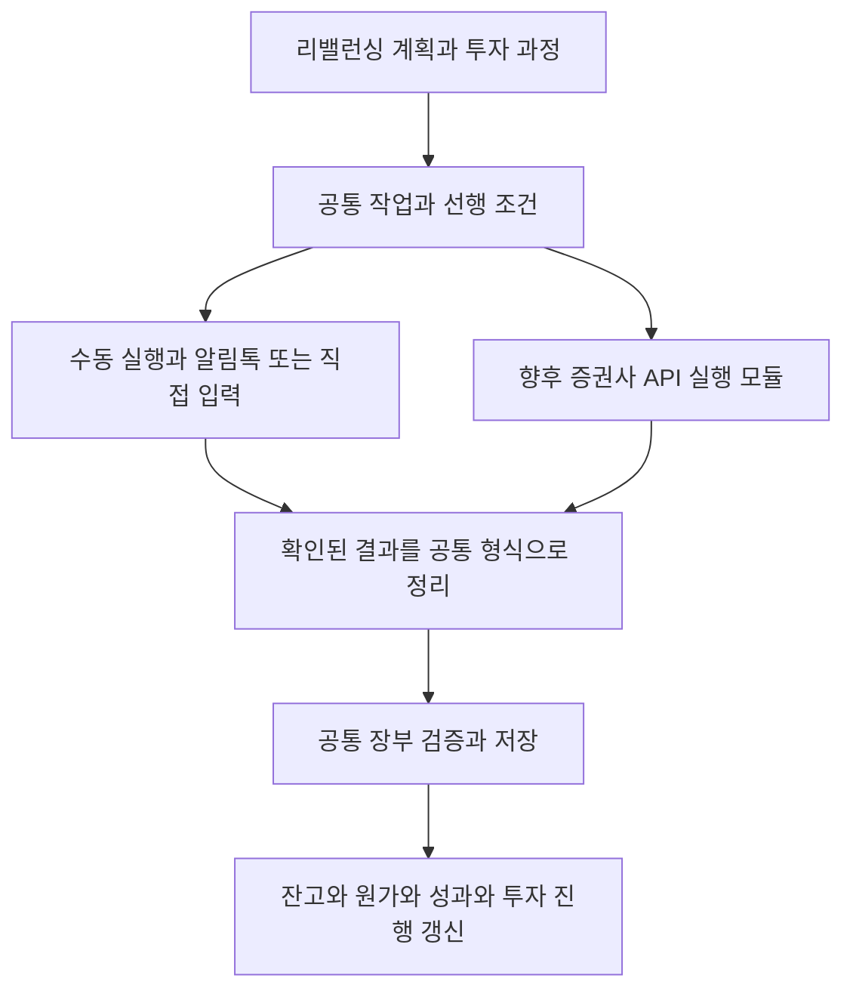

# 투자 실행 관리 개발계획

2026년 10월 10일 · 두 번째 검토안 · 5번과 8번 공통 입력 및 후속 자동화 구조 반영

월 2회 정도 진행하는 투자를 하나의 과정으로 관리한다. 리밸런싱 계획을 만든 다음 입금, 계좌 간 이체, 국내 매매, 환전, 미국 매매를 기록하고 다음 접속에서 이어간다. 사용자가 무엇을 끝냈고 무엇이 남았는지 기억하는 부담을 줄이는 것이 목표다.

첫 버전은 수동 실행과 NH 알림톡 입력을 연결하는 기능으로 완성한다. 5번과 8번에서 같은 입력 기능을 사용하며, 실제 장부 변경은 하나의 공통 서버 처리 경로로 수행한다. 입금·이체·매매·환전 작업의 목표, 실행 결과, 장부 반영을 처음부터 분리하여 나중에 일부 단계를 자동화해도 투자 과정과 장부의 기본 구조를 유지한다.

실제 주문·은행 이체·환전 자동 실행과 Lightsail 이전은 별도 후속 과제로 둔다. 후속 자동화에는 실행 프로그램, 증권사 연결, 승인 조건과 안전장치의 추가 개발이 필요하다. 그때도 이번에 만드는 작업 식별자, 진행 관리, 결과 형식, 공통 장부 처리 경로는 이어서 사용한다. 향후 모든 API의 특성을 미리 예측하여 DB 변경까지 영구히 없앨 수 있다는 약속은 하지 않으며, 핵심 구조의 재설계를 피하는 것을 목표로 한다.

## 1 사용자가 검토할 핵심 제안

| 항목 | 제안 |
| --- | --- |
| 화면 위치 | 기존 1~7번을 유지하고 8번 투자 실행 탭 추가 |
| 계획 작성 | 4번 리밸런싱 전략에서 계산 후 투자 실행 시작 |
| 장부 입력 | 5번과 8번 모두 입력 허용, 공통 입력 화면과 서버 검증·저장 기능 사용 |
| 후속 자동화 | 작업별 실행 방식과 연결 모듈을 추가하며 같은 결과·장부 처리 경로 사용 |
| 기본 입력 | NH 알림톡 붙여넣기, 예외에는 수동 입력 |
| 진행 중인 투자 | 포트폴리오당 1개, 완료·중단된 투자는 별도 목록 |
| 실행 결과 | 저장된 실제 장부 기록을 근거로 진행률 계산 |
| 화면 구성 | 지금 할 일 우선, 완료 내역과 계산 설명은 접기 |
| 개발 검토 | 화면 예시를 먼저 검토한 다음 연결·저장 기능 개발 |
| 운영 반영 | 단계별 로컬 커밋, 전체 검토·승인 후 한 번의 main 병합과 push |

기존 1~7번 유지와 8번 추가, 첫 버전의 매수 중심 범위, 포트폴리오당 진행 중인 투자 1개, 화면 예시 우선 검토 및 최종 승인 후 병합·push 방향은 사용자가 확인했다. 이번 최신안은 8번 안의 직접 입력과 후속 자동화를 위한 공통 구조를 구체화한다.

## 2 현재 코드에서 재사용할 부분

검토 기준은 main의 1b5aeea이며, 계획서 작성 전 미커밋 변경은 없었다. 아래는 저장소의 코드 상태를 확인한 내용이며 운영 DB의 자료를 읽은 결과가 아니다.

| 기존 기능 | 확인 위치 | 활용 방법 |
| --- | --- | --- |
| 리밸런싱 계산 | backend/routers/rebalance.py, logic/rebalance_calculator.py | 종목·계좌·수량 계획 생성 유지 |
| 계획 저장과 실제 매매 연결 | backend/routers/plans.py, data/repositories/plans.py | 저장 계획을 투자 실행의 출발점으로 사용 |
| 계획별 체결 수량과 남은 수량 | frontend/src/utils/planProgress.js | 실제 거래를 합산하는 기준 재사용 |
| 알림톡 묶음 입력 | backend/routers/nh_notices.py, data/repositories/nh_notices.py | 입금·출금·환전·국내 매수 기록 처리 |
| 수동 입력과 정정 | frontend/src/components/Tab4History/HistoryTab.jsx 및 하위 화면 | 해외 매매, 아내 ISA, 누락·오류 보정 |
| 저장 후 화면 갱신 | frontend/src/utils/bookkeepingRefresh.js | 자산·원가·기록·성과에 투자 진행 갱신 추가 |
| 스키마와 보안 | data/workflow_schema.py, data/security_schema.py | 새 연결 정보에도 기존 보안 원칙 적용 |

현재 계획은 실제 매매와만 연결할 수 있고, 이체 진행은 자동 판정하지 않는다. 매매 연결은 계획 저장 이후의 동일 계좌·종목·방향 거래만 허용한다. 새 기능에서는 이 보호를 유지하고 입금·이체·환전 연결을 추가한다.

현재 이체 계획은 금액과 안내를 중심으로 저장된다. 실제 실행용으로는 출발 계좌, 도착 계좌, 통화, 금액이 명확한 작업으로 변환해야 한다. 부족한 연결을 추측해 완료 처리하지 않는다.

리밸런싱 계산에는 기존 현금과 new_cash_krw를 합산하는 부분이 있고 CMA 현금은 별도로 취급된다. 따라서 계획 작성 전후의 실제 입금, CMA에 이미 있는 돈의 사용, 다른 계좌로 옮긴 돈을 구분하는 검토가 반드시 필요하다.

## 3 첫 버전의 사용자 흐름

1. 4번 탭에서 투자 규모를 정하고 리밸런싱 계획을 계산한다.
2. 투자 실행 시작을 누르고 계획 이름, 대표 자금 계좌, 사용할 기존 현금을 확인한다.
3. 8번 탭에 자금 준비, 계좌 이체, 국내 매매, 환전, 미국 매매가 작업 목록으로 나타난다.
4. 사용자가 MTS에서 실제 작업을 수행하고 기록 입력을 누른다.
5. 8번 안에서 공통 입력 화면을 열고 투자 과정과 해당 작업 정보를 전달한다. 5번에서도 동일한 입력 화면을 사용할 수 있다. 기존 미완료 초안을 덮어쓰지 않는다.
6. 알림톡을 반복해서 붙여넣거나 수동으로 여러 건을 입력한다. 최종 확인 후 공통 장부 기능으로 저장한다. 8번에서 투자 과정 밖 거래가 섞이면 해당 기록의 연결 대상을 따로 확인한다.
7. 저장된 기록이 해당 투자 과정에 연결되고 잔고, 원가, 성과, 진행 상황이 갱신된다.
8. 다음날 앱을 열면 남은 미국 매매부터 이어간다. 결과를 확인하고 이번 투자를 종료한다.

입금 전에 계획을 만들 수도, 입금 후 만들 수도 있어야 한다. 시작 화면에서 이미 장부에 반영된 입금과 앞으로 들어올 돈을 구분한다. 총 투자 예산과 추가로 들어올 현금을 같은 값으로 취급하지 않는다. 기존 자금을 모두 이번 투자에 쓸 수 있다고 가정하지 않고 사용 범위를 지정한다.

같은 작업에 체결 기록을 여러 번 연결할 수 있다. 국내 종목 몇 개만 먼저 매수하거나 VT가 여러 번 나누어 체결되어도 진행 상황을 잃지 않는다. 이체·환전·매매는 필요한 작업끼리 의존 관계를 두며 모든 계좌의 작업을 일괄적으로 잠그지 않는다.

## 4 화면과 조작 방식

모바일 첫 화면에는 투자 이름, 계획 예산, 현재 할 일, 남은 작업 수를 표시한다. 실제 화면 문구는 짧게 유지한다.

화면 예시는 다음과 같다. 금액은 화면 설계를 위한 예시다.

> 10월 정기 투자 · 계획 예산 115만원
> 지금 할 일: 국내 ETF 매수 기록 2건
> 기록 입력 · 이미 입력한 기록 연결
> 다음 할 일: 달러 환전 → VT 매수
> 완료한 작업 3건 펼치기

작업별로 계좌 별칭, 종목, 필요 수량 또는 금액, 기록된 수량 또는 금액, 남은 양을 보여준다. 계좌번호는 필요할 때만 일부 표시한다. 복잡한 장부 원가, 내부 요청 번호, 연결 규칙은 기본 화면에서 숨긴다.

5번은 전체 기록의 입력·조회·취소·정정과 과거 누락 처리를 담당한다. 8번은 이번 투자에 필요한 결과 입력과 진행 확인을 담당한다. 8번의 기록 입력은 공통 폼을 해당 작업 카드 안이나 별도 입력 영역에 열어 탭을 오갈 필요를 줄인다. 취소·정정은 첫 버전에서 해당 기록을 지정하여 5번으로 연결한다. 두 화면의 계좌 선택·날짜 확인·최종 저장 보호가 다르게 동작하지 않게 한다.

기본 버튼은 기록 입력, 기존 기록 연결, 실행 계속하기, 이번 투자 종료로 한정한다. 계획 변경과 연결 해제는 상세 메뉴에 둔다. 완료된 실제 거래가 취소되면 해당 작업이 다시 남은 작업으로 표시된다.

이번 투자 종료 시 미실행 작업이 남으면 계획보다 덜 매수하고 종료를 선택할 수 있다. 끝나지 않은 작업을 체결된 것처럼 표시하지 않고 미실행 사유와 잔여 금액을 보고서에 남긴다.

## 5 진행 상태와 판단 기준

투자 전체는 준비 중, 진행 중, 일시 중단, 종료로 구분한다. 작업은 예정, 일부 기록됨, 완료, 제외로 표시하고 문제가 있으면 확인 필요를 덧붙인다.

매매 진행은 실제 기록의 수량으로 계산한다. 가격이 달라져 실제 지출액이 계획과 달라도 수량 목표와 금액 차이를 구분한다. 과매수는 완료 표시와 함께 초과 수량을 알린다. 순수 매수 계획에 계획 밖 매도가 생기면 자동 상계하지 않고 재검토한다.

입금·이체는 선택한 실제 기록의 금액을 합산한다. 환전은 실제 원화 지출액과 달러 유입액으로 확인하며, 기존 달러를 차감하고 필요한 추가 달러만 안내한다. 환전 추정액을 실제 달러 취득 원가로 저장하지 않는다.

첫 버전에서 작업 완료의 의미는 사용자가 확인하여 장부에 저장한 내역이 계획을 충족한다는 것이다. 향후 자동 실행에서는 증권사에서 확인한 결과와 장부 반영 여부를 각각 표시한다. 증권사 API로 확인하지 않은 거래를 증권사 확인 완료라고 표현하지 않는다.

화면에 보이는 간단한 상태와 서버가 보존하는 상세 상태를 분리한다. 향후 자동화에 필요한 실행 요청됨, 실행 결과 확인 중, 일부 실행됨, 실행 사실 확인됨, 장부 반영 대기, 반영 완료, 확인 필요 상태를 구분할 수 있는 구조를 처음부터 둔다. 주문 접수·취소 요청·실제 체결·장부 반영을 같은 완료 상태로 합치지 않는다.

현재 실제 잔고가 충분하면 추가 입금·이체·환전이 필요하지 않을 수 있다. 이때 자금이 이미 확보된 작업으로 안내하며 가상의 입금 기록을 만들지 않는다.

## 6 장부 무결성을 유지하는 방법

- 계획 작성, 시작, 일시 중단, 종료, 연결 해제는 잔고·수량·원가·성과를 변경하지 않는다.
- 5번·8번의 사용자 입력과 향후 자동 결과 반영은 동일한 공통 장부 처리 경로를 사용한다. 화면별 또는 증권사별로 별도의 잔고 변경 로직을 만들지 않는다.
- 같은 실제 기록을 두 투자 과정에서 재사용하지 못하도록 서버와 DB에서 검증한다. 같은 금액의 별도 실제 거래는 다른 기록으로 처리할 수 있어야 한다.
- 기존 기록 연결은 조회와 연결만 수행한다. 장부에 매매·입출금·환전을 다시 생성하지 않는다.
- 같은 포트폴리오 내 이체를 외부 투자금으로 분류하지 않는다. 포트폴리오 간 이체의 양쪽 기록도 기존 처리 규칙을 재사용한다.
- 반대쪽 이체 알림을 다시 입력하거나 수동 입력 뒤 알림톡을 넣어도 기존 중복 확인을 유지한다. 금액과 날짜만으로 무조건 같은 거래라고 판정하지 않는다.
- 연결할 계좌·종목·통화·방향과 포트폴리오 소속을 서버에서 확인한다. 모호한 후보는 사용자가 선택한다.
- 여러 단계가 하루에 모두 완료될 필요는 없다. 실제 거래 저장의 묶음 단위는 기존 기능을 유지하고 투자 전체를 한 번의 금융 트랜잭션으로 만들지 않는다.
- 장부 저장은 성공했지만 화면 갱신이 실패하면 저장됨을 먼저 알리고 재입력을 막는다. 요청 번호를 이용한 기존 결과 확인을 유지한다.
- 실제 기록의 취소·정정·삭제를 반영하여 진행 상황을 다시 계산한다. 기존 최신 순서 취소 및 원가 보호를 약화하지 않는다. 장부 기록 취소는 실제 증권사 거래의 취소나 재주문을 의미하지 않는다. 향후 자동 실행에서도 정정된 작업을 자동 재주문하지 않고 사용자 검토로 돌린다.
- 성과 기준일 이전 누락이나 기존 음수 잔고는 기존 장부 정정 경로로 안내한다. 이번 기능이 과거 자료를 추정 수정하지 않는다.

예상 잔고가 부족하면 어느 계좌에서 얼마가 부족한지와 다음 조치를 보여준다. 입력을 막는 메시지만 띄우고 해결 경로가 없는 상황은 허용하지 않는다. 다만 부족한 예수금으로 새 매수를 기록하는 보호 자체는 유지한다.

## 7 자금 계획과 변경 처리

첫 버전은 사용 빈도가 높은 신규 자금 투입에 따른 매수 과정을 우선 지원한다. 기존 매도 기능은 그대로 사용할 수 있으며, 매도를 포함하는 복합 리밸런싱을 새 실행 과정에서 적극 지원하는 것은 다음 단계로 둔다.

ISA·IRP·연금저축 및 아내 ISA는 사용자 방침에 따라 자금 출발 계좌 후보에서 제외한다. 해당 계좌에서 매도 후 생긴 현금은 계좌 안에서 사용할 수 있도록 구분한다. 모든 계좌의 출금 가능 여부와 이번 투자에 사용할 현금을 사용자 확인 가능한 설정으로 관리한다.

첫 버전의 실행 과정은 한 포트폴리오를 대상으로 한다. 다른 포트폴리오에서 자금을 받아오는 이체는 기존 5번 기능으로 기록하고 실제 유입 기록을 연결할 수 있다. 여러 포트폴리오를 동시에 최적화하는 통합 자금 계획은 범위에 포함하지 않는다.

기존 잔고·종목·가격이 달라져도 저장된 계획을 조용히 바꾸지 않는다. 실행 전 검토 화면에서 당시 계획과 현재 상태의 차이를 보여주고 필요한 작업만 다시 산출한다. 재계산이 외부 시세 수집을 유발하는 경우 실행 시작·명시적인 재계산 때만 수행하여 탭 열기 속도를 보존한다.

일부 매수를 끝낸 뒤 계획을 바꾸면 실제 거래와 기존 계획을 보존하고 남은 작업만 새 버전으로 만든다. 이미 사용한 금액·체결 수량을 새 계획에서 다시 요구하지 않는다. 시세나 환율의 단순 변동은 안내 예상치를 바꾸며 사용자가 확인한 목표 수량을 자동 변경하지 않는다.

수수료 등으로 실제 잔고와 앱 장부가 다를 수 있으므로 확보 금액 안내는 앱 장부 기준임을 표시한다. 필요한 경우 기존 정정 기능으로 이동한다. 이번 개발에서 증권사 잔고를 자동 덮어쓰지 않는다.

## 8 자동화에도 유지할 공통 구조

### 작업과 실행 결과와 장부의 분리

한 작업에는 무엇을 할 것인지, 실제로 무엇이 일어났는지, 장부에 무엇을 반영했는지를 따로 보존한다. 수동·자동은 작업의 종류가 아니라 작업을 수행하는 방식이다. 예를 들어 VT 매수 작업은 동일하게 유지하고 실행 방식만 수동에서 API로 바꾼다. 완료 여부는 결과와 실제 기록에서 계산한다.

첫 버전에는 수동 경로와 합성 검증용 모의 API 모듈만 만든다. 실제 증권사 주문 전송과 상시 실행 프로그램은 만들지 않는다. 모의 모듈은 운영에서 실행할 수 없도록 분리하고 실제 네트워크를 호출하지 않는다.

### 실행 방식과 계좌별 지원 범위

작업에는 종류, 계좌·종목·통화, 목표 수량·금액, 선행 작업, 계획 버전, 실행 방식과 승인 범위를 보존한다. 종류는 외부 입출금, 계좌 이체, 환전, 매수, 매도를 구분하며 첫 화면은 매수 중심 범위만 제공한다. 계좌·통화별 실행 가능 여부를 따로 관리한다.

계좌 이체의 양쪽 계좌, 환전의 원화·달러 금액, 매매의 방향과 수량을 데이터로 표현한다. 안내 문장만 저장하여 나중에 프로그램이 문장을 해석해야 하는 구조를 피한다.

수동 실행 모듈은 사용자에게 필요한 동작을 안내하고 확인된 입력을 받는다. 향후 API 모듈은 실행 요청, 상태 조회, 결과 확인, 지원 시 미체결 정정·취소를 담당한다. 두 방식은 같은 결과 형식과 장부 접점을 사용한다. API 모듈이 직접 잔고를 변경하지 않는다.

첫 버전의 승인 범위는 계획 확인과 기록별 최종 확인이다. 향후 실제 자동 실행에는 계좌·종목·방향·예산·수량·가격 조건·유효시간·계획 버전에 대한 별도 승인을 추가한다. 현재의 투자 실행 시작 버튼을 자동 주문 승인으로 해석하지 않는다. 지원되지 않는 단계는 수동 방식으로 유지한다.

### 실행 시도와 확인된 결과

한 작업에서 여러 체결이나 실행 시도가 생길 수 있다. 작업 식별자, 실행 시도 식별자, 장부 요청 번호를 분리한다. 재조회와 장부 재시도는 새 증권사 주문 제출로 이어지지 않는다.

공통 결과는 작업·계획 버전, 원본 출처, 계좌·통화·종목·방향, 실제 발생일시, 수량·단가·환율·실제 현금 변동, 수수료 등 확인 가능한 항목, 원본 식별 정보, 사용자 또는 증권사 확인 여부를 포함한다. 미확인 값은 추정하여 확정하지 않는다. 매수는 부분 체결별 결과를 허용하고 주문 전체와 개별 체결을 구분한다.

수동 알림톡과 API에서 같은 거래가 도착하면 원본 주문·체결 식별 정보와 기존 입력 출처를 이용해 중복을 확인한다. 요청 번호만으로 서로 다른 입력 경로의 중복까지 해결됐다고 간주하지 않는다. 계좌·날짜·수량·가격만으로 확정할 수 없으면 확인 필요로 남긴다. API가 누적 체결량만 제공하는 경우 중복·역순 도착을 검증한 뒤 새로 확인된 증가분만 반영한다.

계획 변경 후 늦게 도착한 실제 체결은 버리거나 새 계획 주문으로 간주하지 않는다. 원래 승인된 작업·버전의 실행 결과로 보존하고 현재 진행 화면에 영향을 알린다.

외부 실행 사실의 확인과 장부 반영 상태는 별개다. 향후 자동화에서는 실제 체결이 확인됐으나 예수금·원가 검증 때문에 장부 반영이 대기할 수 있다. 이때 체결 사실을 보존하고 장부만 재검토하며 같은 매수를 다시 실행하지 않는다. 수동 입력은 기존 묶음 저장의 전체 성공 또는 전체 미반영 원칙을 유지한다.

### 저장 구조와 기존 기록 연결

기존 계획·장부를 보존하고 다음 역할의 저장 구조를 처음부터 설계한다. 상세 컬럼과 실제 테이블 분리는 구현 전 합성 DB에서 확정하되 역할과 식별자는 유지한다.

| 구성 | 저장할 내용 |
| --- | --- |
| investment_cycles | 포트폴리오, 원본 계획, 실행 이름, 상태, 계획 버전, 자금 사용 범위, 생성·종료 시각 |
| investment_steps | 안정적인 작업 식별자, 종류, 계좌·통화·종목, 목표량, 선행 조건, 실행 방식, 승인 범위 |
| investment_attempts | 작업별 시도, 실행 방식, 승인된 버전, 외부 요청 식별 정보, 상태·오류·확인 시각 |
| investment_results | 출처와 원본 식별 정보, 확인된 실행 사실, 부분 체결, 장부 반영 상태와 연결 |
| investment_record_links | 입출금·이체·환전의 실제 원본 기록과 작업 연결, 연결·해제 이력 |

수동에서도 실행 결과를 같은 구조로 연결한다. 향후 자동화 필드를 첫 버전에 모두 사용하거나 복잡한 화면으로 노출할 필요는 없다. 새로운 거래 장부를 복제하지 않고 실제 잔고·보유·원가·성과의 기준은 기존 장부로 유지한다. 원문 전체를 불필요하게 복사하거나 비밀키를 이 테이블에 저장하지 않는다.

매매와 원본 계획 행의 연결은 rebalance_plan_links를 재사용한다. portfolio_execution.record_links는 실행 결과의 원본 참조와 연결 해제를 저장한다. 사용 중인 계획의 별도 연결 변경을 차단하여 두 관계의 일관성을 유지하며 동일 매매를 다시 장부에 생성하지 않는다. 기존 연결 제약과 새 계획 버전 간 호환을 검증하고, 행 순서가 바뀌어도 다른 작업에 거래가 붙지 않도록 안정적인 작업 식별자를 연결한다. 기존 기록을 연결할 때는 원본을 변경하지 않고 출처 참조만 추가한다.

진행 수량과 지출액은 실제 원본 기록에서 계산한다. 요약을 저장하더라도 원본이 기준이며 재계산 가능해야 한다. 종료 보고서는 종료 당시 결과와 이후 취소·정정으로 바뀐 내용을 구분한다.

### 공통 입력과 장부 접점

5번과 8번은 동일한 입력 구성 요소, 초안 관리, 요청 복원과 서버 검증을 사용한다. 기존 입력 전체를 새로 만드는 대신 필요한 알림톡·수동 폼과 저장 기능을 함께 사용할 수 있게 분리한다. 두 화면에서 다른 투자 작업으로 초안을 옮기려면 명시적인 확인을 받으며 저장 결과 확인 중인 요청은 내용을 바꾸지 않는다.

장부 저장과 해당 투자 과정 연결은 같은 트랜잭션으로 처리한다. 기존 기록 연결은 금융 데이터 변경 없이 연결만 저장한다. 요청 번호와 입력 비교에는 실행 연결 정보를 일관되게 포함하고, 5번·8번 동시 요청과 기존 클라이언트의 연결 정보 없는 입력도 검증한다.

자동 결과도 같은 장부 검증을 적용하되 로그인한 사용자의 브라우저 세션을 상시 실행 프로그램의 인증 수단으로 사용하지 않는다. 향후 프로그램의 최소 권한·인증 및 승인 확인을 별도로 마련한다. 검증 실패가 나면 보호를 해제하거나 잔고를 임의 변경하지 않는다.

코드 변경은 탭·화면 이동, 계획 시작, 공통 입력의 필요한 부분 분리, 실행 API·저장소·장부 접점, 스키마·보안과 테스트에 한정한다. 기존 계산기 전체 재작성이나 공통 UI 전면 리팩토링을 함께 진행하지 않는다.

새 테이블·인덱스는 반복 적용 가능한 추가 변경으로 만든다. 2단계에서는 비공개 portfolio_execution 스키마에 5개 테이블을 추가한다. 기존 data/security_schema.py의 public 20개 목록·보안 버전·스냅샷은 유지하며, 비공개 스키마 소유권·RLS·역할별 접근 차단을 별도로 검증한다. 기존 보안 스냅샷을 덮어쓰지 않는다. Data API 꺼짐, 세션 인증, 새 테이블 RLS 및 공개 역할 권한 제한을 유지한다.

첫 버전은 새 증권사 인증정보와 상시 작업 서버를 요구하지 않는다. 프런트엔드의 직접 DB 접근도 추가하지 않는다.

## 9 개발 단계와 검토 시점

| 단계 | 결과물 | 완료 조건 |
| --- | --- | --- |
| 1 화면 및 연결 규칙 | 8번 내 공통 입력을 포함한 합성 화면 예시, 작업·결과·장부 구분과 자금 연결 규칙 | 사용자가 지금 할 일과 남은 작업을 이해하고 화면 방향 확인 |
| 2 실행 과정 저장 | 실행 과정·작업·시도·결과·기록 연결, 공통 장부 접점과 합성 DB 검증 | 저장·재개·계획 변경·동시 요청·보안 및 실행 방식 교체 검증 통과 |
| 3 공통 입력 연결 | 4번에서 시작, 5번·8번 공통 입력 및 결과 갱신 | 반복 알림톡·수동 입력·초안 복원·기존 기록 연결·취소가 하나의 흐름으로 동작 |
| 4 최종 검증 및 배포 준비 | 전체 시나리오 결과, 변경 요약, 배포·롤백 문서 | 사용자가 로컬 화면 확인 후 병합·push 승인 |

개발은 codex/investment-execution 브랜치에서 진행한다. 단계별로 의미 있는 로컬 커밋을 남기되 사용자 승인 전에는 main 병합·push·배포하지 않는다. 기본 목표는 최종 운영 배포 1회이며, 중간 배포가 필요해지면 그 이유와 검토 가능한 결과를 먼저 제시한다.

화면 확인 전에 저장 구조와 입력 경로를 모두 개발하지 않는다. 1단계의 계좌 이체 모델이나 자금 분류가 예상보다 복잡하면 이를 먼저 보고하고 범위를 조정한다. 기존 코드에서 재사용 가능한 보호를 새로 구현하느라 시간을 쓰지 않는다.

몇 분의 버튼 수정에 해당하는 작업은 아니다. 일정은 1단계 연결 규칙을 확정한 뒤 추정하는 것이 타당하다. 진행 중에는 완료한 범위, 남은 범위, 지연 원인을 짧게 알리고 긴 도구 오류 재시도를 반복하지 않는다. 첫 개발의 목표는 사용자가 검토할 수 있는 화면 예시다.

## 10 반드시 검증할 사례

검증은 운영망과 분리한 환경에서 합성 데이터로 수행한다. 아래는 앞으로 수행할 검증 계획이며 이번 계획서 작성에서 실행한 테스트 결과가 아니다.

| 사례 | 통과 기준 |
| --- | --- |
| 계획·실행 생성만 수행 | 예수금·보유·원가·성과가 변경되지 않음 |
| 입금 후 계획 시작 | 이미 들어온 돈을 추가 투자금으로 다시 더하지 않음 |
| 계획 후 입금 및 CMA 자금 사용 | 기록 연결로 자금 준비 완료, 기존 현금의 사용 범위 보존 |
| 여러 종목 알림톡 반복 입력 | 한 번의 저장 또는 여러 번의 저장 모두 작업별로 정확히 집계 |
| 같은 날 별도 같은 금액 입금 | 사용자 확인 후 별도 기록 허용, 하나의 입금을 중복 연결하지 않음 |
| 기존 기록 연결 | 원본 기록·잔고 변경 없이 진행 상황만 갱신 |
| 내부·포트폴리오 간 이체 | 원화·달러 잔고와 성과 분류가 기존 규칙과 일치 |
| 기존 달러 보유 후 추가 환전·VT 매수 | 남은 달러를 고려하고 실제 환율 이동평균 계산을 그대로 사용 |
| 일부 체결 후 계획 변경 | 끝낸 수량과 비용 보존, 남은 작업만 다시 안내 |
| 계획보다 적게 또는 많이 매수 | 부분 완료·초과를 구분, 미실행 종료 가능 |
| 저장 중 통신 끊김·더블 클릭·5번과 8번 동시 저장 | 기존 요청 복원, 실제 장부와 실행 연결의 중복·유실 방지 |
| 수동 실행과 모의 API 실행의 교체 | 같은 투자 과정과 작업 식별자를 사용하고 동일 결과 형식·장부 경로로 완료 |
| 모의 API 부분 체결·응답 지연·재시작 | 확인된 부분만 반영, 불명확한 실행은 중단하고 재전송하지 않음 |
| 자동 결과와 알림톡의 중복 도착 | 충분한 원본 식별 근거로 한 번만 반영, 불확실하면 사용자 확인 |
| 실행 사실 확인 후 장부 반영 실패 | 실제 실행 결과 보존, 주문 재실행 없이 장부 반영만 재검토 |
| 기록 취소·정정 후 자동화 대상 작업 | 진행은 재계산하되 자동 재주문하지 않음 |
| 실제 거래 취소·정정·삭제 | 진행 상황 재계산, 기존 원가·취소 보호 유지 |
| 예수금 부족·과거 누락·음수 잔고 | 금액과 해결 경로 안내, 계획 완료로 잔고를 억지 보정하지 않음 |
| 화면 이동 및 초안 복원 | 미완료 입력 보존, 다른 포트폴리오에 입력 정보가 섞이지 않음 |
| 백엔드·프런트엔드 버전 차이 | 기존 입력 유지, 새 실행 기능만 준비될 때까지 비활성화 |
| 모바일 320·390·430px | 화면 가로 스크롤 없이 현재 작업·기본 버튼 확인, 터치 조작 가능 |
| 기존 화면 성능 | 1번 조회에 새 필수 요청 없음, 실행 화면에서 전체 과거 기록을 매번 읽지 않음 |
| 신규 API·테이블 접근 제한 | 비인가 API 차단, 공개 DB 역할 접근 차단, 정상 기능 유지 |

기존 pytest, 프런트엔드 테스트·lint·build와 별도 PostgreSQL 통합 검증을 사용한다. 브라우저 도구가 연결되지 않으면 합성 페이지의 헤드리스 브라우저 시각·터치 이벤트 검증을 시도한다. 실제 휴대폰에서의 검토와 자동 검증을 구분하여 보고한다.

## 11 배포와 롤백

운영 반영 전에 새 백업을 만들고 복구 절차를 확인한다. 과거의 백업을 최신으로 간주하지 않는다. 추가 스키마와 새 테이블 보안을 함께 적용한 뒤 권한·정상 읽기를 확인한다.

프런트엔드는 새 백엔드 기능 제공 여부를 확인한다. 준비되지 않았으면 투자 실행만 비활성화하고 기존 기록 입력은 유지한다. main push로 Vercel이 먼저 배포되더라도 기존 앱 기능이 유지되게 설계한다. 이후 사용자가 Render를 수동 배포하고 새 실행 기능을 확인한다.

서버 초기화에서 비공개 실행 스키마를 추가하고 보안을 함께 적용한다. 기존 public 테이블 수·권한 스냅샷과 충돌하지 않는지 합성 DB에서 검증한다. 기존 public 보안 롤백은 비공개 실행 스키마 권한을 열지 않는다.

문제가 생기면 새 실행 기능을 끄고 기존 5번 입력을 사용한다. 필요하면 이전 프런트엔드와 백엔드로 복귀한다. 추가 테이블과 실제 기록은 삭제하지 않는다. 코드 롤백은 실제 매매·이체·환전을 취소하지 않으며, 금융 기록의 취소는 기존 장부 기능으로 처리한다.

## 12 후속 자동화에서 추가할 부분과 유지할 부분

| 유지할 구조 | 후속 단계에서 추가할 요소 |
| --- | --- |
| 투자 과정과 작업 식별자, 계획 버전 | 계좌별 실제 API 지원 여부와 연결 설정 |
| 단계별 선행 조건과 남은 작업 계산 | 주문·이체·환전 실행 모듈과 상태 조회 |
| 공통 결과 형식과 기존 장부 처리 | 증권사별 응답 변환, 체결·수수료 확인 |
| 실행 시도와 결과 확인 및 반영 상태 | 상시 실행 프로그램, 작업 점유·복구·예약 실행 |
| 사용자 확인과 승인 범위 모델 | 가격·시간·예산 한도와 실제 자동 실행 승인 |
| 5번 기록 관리와 8번 진행 화면 | 자동 실행 시작·중지 및 확인 필요 표시 |

수동 방식에서 자동 방식으로 바꾸더라도 같은 투자 과정과 작업을 사용한다. 지원된 계좌의 특정 작업만 자동화하고 나머지는 수동으로 남길 수 있다. 자동 실행 모듈과 설정·안전장치 추가로 확장하되 신규 기능에 필요한 컬럼이나 인덱스의 추가 변경은 허용한다.

자동 실행 프로그램은 브라우저가 닫혀 있어도 작동하도록 백엔드와 별도로 운영한다. 외부 요청 중 DB 트랜잭션을 길게 열어두지 않고 실행 상태를 보존한다. 복수 프로그램이나 재시작으로 동일 작업이 동시에 실행되지 않도록 작업 점유와 복구를 추가한다. 증권사가 요청을 받았는지 불명확하면 상태를 조회하고 확인 전에는 재전송하지 않는다. 단순 실패 재시도 기능을 금융 주문에 그대로 적용하지 않는다.

자동 주문에는 승인 범위·가격·수량·예산 제한, 미체결·부분 체결 확인, 통신 불확실 시 중단, 중지 기능이 필요하다. 계좌·시간·시장별 조건은 그때 확인한다. 현재 사용 중인 증권사 연결의 TLS 검증·로그 보호도 실제 주문 도입 전에 점검한다. Lightsail 이전은 별도 운영 과제로 검토한다.

자동화를 꺼도 이미 제출한 주문이나 체결을 되돌릴 수는 없다. 신규 실행을 멈추고 진행 중인 외부 결과를 확인한다. 주문 취소·장부 취소·투자 과정 종료를 구분하여 처리한다. 수동으로 전환하기 전에도 미체결 주문과 불명확한 실행이 없는지 확인한다.

첫 버전 완료 기준은 여러 날에 걸친 투자를 5번·8번 공통 입력으로 진행하고 남은 작업·결과를 정확히 확인하는 것이다. 추가로 같은 작업에 합성 모의 API 결과를 공급해도 장부 처리와 진행 계산을 바꿀 필요가 없는지 검증한다. 이 검증은 향후 실제 주문의 안전성을 검증한 것으로 간주하지 않는다.

## 13 확인된 방향과 이번 최신안의 검토 사항

기존 1~7번 유지와 8번 추가, 매수 중심 첫 버전, 포트폴리오당 진행 중인 투자 1개, 화면 예시 우선 검토와 최종 승인 후 병합·push 방향은 사용자가 확인했다. 8번에서도 공통 기능으로 장부 입력을 허용하는 방향도 동의했다.

이번 최신안은 다음 내용을 설계 기준으로 추가한다.

1. 5번과 8번은 같은 입력·초안·요청 복원·장부 처리 기능을 사용한다.
2. 작업 목표, 실행 시도, 확인된 실행 사실, 장부 반영을 별도로 보존한다.
3. 수동과 자동은 같은 작업의 실행 방식으로 두며 계좌·단계별로 혼합할 수 있게 한다.
4. 자동화는 실행 모듈·상시 프로그램·승인 조건을 추가하는 방법으로 확장한다.
5. 첫 버전은 실제 자동 실행 없이, 모의 결과로 실행 방식 교체와 중복·부분 체결 상황을 검증한다.
6. 기존 장부·투자 과정의 재설계를 피하되 후속 기능에 필요한 추가 스키마 변경까지 금지하지 않는다.

이번 요청은 계획서 최신화이며 앱 코드·DB·운영 설정 변경, 커밋·push·배포는 수행하지 않는다. 개발 착수 시 첫 결과물은 8번 안의 공통 입력을 포함한 합성 화면 예시다.

## 14 개발 진행 기록

1단계 화면 방향은 사용자 확인을 받았다. 2단계 저장·공통 장부 접점의 실제 구현과 합성 검증 결과는 [investment-execution-stage2.md](investment-execution-stage2.md)에 기록한다. 3단계 실제 화면 연결과 합성 검증을 완료했으며 결과는 [investment-execution-stage3.md](investment-execution-stage3.md)에 기록한다. 4단계 최종 검증·배포 준비와 사용자 검토는 아직 남아 있다.
